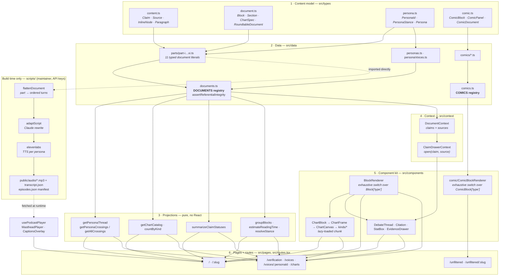
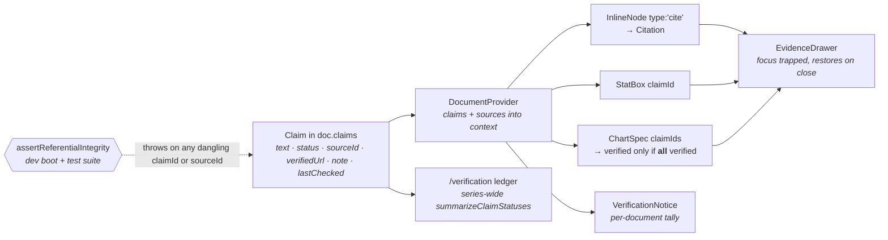
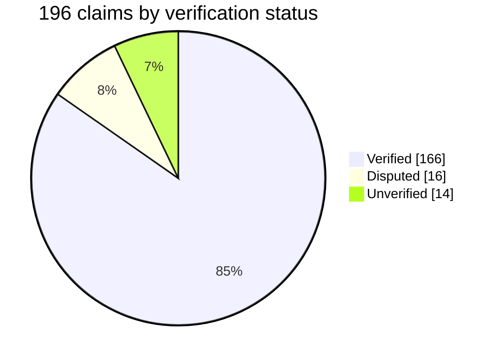

# The AI Reckoning

An eleven-part roundtable debate site about artificial intelligence, built as **content-as-data**:
typed schemas define the content model, data files hold every word and figure, and one shared
component kit renders all of it. There is no hand-authored page markup, and every statistic in the
series is an individually addressable, verifiable `Claim`.

A companion comic series (**Roundtable Reckoning**, at `/unfiltered`) and a build-time podcast
pipeline that turns any part into a voiced episode ship alongside it.

| At a glance        |                                                                     |
| ------------------ | ------------------------------------------------------------------- |
| Parts published    | 11 roundtables, 46 rounds, 206 debate turns                         |
| Recurring panel    | 15 personas, declared once and referenced by id                     |
| Evidence           | 196 claims, 98 sources, 84.7% verified against primary sources      |
| Data visualization | 45 charts across 10 chart kinds, hand-built as React SVG            |
| Audio              | Build-time podcast pipeline (Claude rewrite + ElevenLabs synthesis) |
| Comic series       | 1 episode (`/unfiltered`), its own isolated design system           |
| Tests              | 279 tests in 36 files (Vitest + Testing Library)                    |

## Quick start

```bash
pnpm install
pnpm dev            # http://localhost:5173
pnpm build          # tsc -b && vite build
pnpm preview

pnpm typecheck      # tsc -b, no emit
pnpm lint           # eslint
pnpm format         # prettier --write .
pnpm test           # vitest run
pnpm test:watch     # vitest interactive
pnpm vitest run src/data/documents.test.ts   # a single file
```

Husky + lint-staged run ESLint and Prettier on staged files at commit time.

---

## Tech stack

### Runtime (shipped to the browser)

| Layer            | Choice                                                        | Notes                                                                               |
| ---------------- | ------------------------------------------------------------- | ----------------------------------------------------------------------------------- |
| UI               | **React 19.2**                                                | Function components only; `use()`-style context providers (`<Ctx value={…}>`).      |
| Compiler         | **React Compiler 1.0** (`babel-plugin-react-compiler`)        | Wired through `@rolldown/plugin-babel` in `vite.config.ts`; auto-memoization.       |
| Language         | **TypeScript ~6.0**                                           | `verbatimModuleSyntax`, `erasableSyntaxOnly`, `noUnusedLocals/Parameters`, no emit. |
| Build            | **Vite 8** (Rolldown-powered)                                 | `pnpm build` runs `tsc -b` first, so a type error fails the build.                  |
| Routing          | **react-router-dom 7**                                        | `createBrowserRouter` over the route table in `src/routes.tsx`.                     |
| Charts           | **d3-scale · d3-shape · d3-array · d3-geo · topojson-client** | Math only. Every mark is hand-authored React SVG; there is no charting library.     |
| Icons            | **lucide-react**                                              | Persona icons are `LucideIcon` values stored on the `Persona` record.               |
| Comic typography | **@fontsource/bangers · @fontsource/permanent-marker**        | Self-hosted, imported only from the comic pages so essay pages never load them.     |
| Styling          | **Plain CSS + custom properties**                             | Four stylesheets, no CSS-in-JS, no utility framework, no preprocessor.              |

### Tooling and quality gates

| Concern     | Choice                                                                                                         |
| ----------- | -------------------------------------------------------------------------------------------------------------- |
| Package mgr | **pnpm** (`pnpm-workspace.yaml`)                                                                               |
| Tests       | **Vitest 4** + **jsdom** + **@testing-library/react / dom / jest-dom**                                         |
| Linting     | **ESLint 10** flat config + **typescript-eslint** + `react-hooks` + `react-refresh` + `eslint-config-prettier` |
| Formatting  | **Prettier 3**                                                                                                 |
| Git hooks   | **Husky 9** + **lint-staged 17**                                                                               |
| Hosting     | **Vercel** (`vercel.json` catch-all SPA rewrite)                                                               |

### Build-time only (never bundled, no keys in the client)

| Purpose         | Choice                                                                     |
| --------------- | -------------------------------------------------------------------------- |
| Script runner   | **tsx** (`node --import tsx scripts/generate-podcast.ts`)                  |
| Script rewrite  | **@anthropic-ai/sdk** (Claude turns debate prose into spoken dialogue)     |
| Voice synthesis | **ElevenLabs REST API** (one cast voice per persona)                       |
| Secrets         | **dotenv** reading `.env.local` (gitignored; no `VITE_` prefix, by design) |

---

## The series

| #    | Part                             | Route                       | Subject                               |
| ---- | -------------------------------- | --------------------------- | ------------------------------------- |
| I    | A Roundtable on Real Costs       | `/real-costs`               | Energy, water, labor, regulation      |
| II   | What's Actually Being Done       | `/whats-being-done`         | Responses already underway            |
| III  | What It's Actually Getting Right | `/getting-right`            | Documented positive outcomes          |
| IV   | The Race We're In                | `/the-race`                 | Incentives, coordination, governance  |
| V    | The Reality Problem              | `/the-reality-problem`      | Truth, synthetic media, trust         |
| VI   | The Tail Risk                    | `/the-tail-risk`            | Safety, alignment, existential stakes |
| VII  | Machines We Talk To              | `/machines-we-talk-to`      | AI companions, loneliness, kids       |
| VIII | Whose Intelligence?              | `/whose-intelligence`       | Power, compute, capital, geopolitics  |
| IX   | The Creativity Question          | `/the-creativity-question`  | Copyright, culture, authorship        |
| X    | Pattern and Prejudice            | `/pattern-and-prejudice`    | Algorithmic racial bias, fairness     |
| XI   | The Ground It Comes From         | `/the-ground-it-comes-from` | Minerals, water, e-waste              |

### The panel

Fifteen recurring voices, declared once in `src/data/personas.ts` and referenced everywhere by
`PersonaId`. Each carries a color token, a Lucide icon, a role, a focus line, a bio, and a default
**stance** that positions their turns on the debate stage.

| Optimists                       | Neutral & independent                                                          | Critics                                                                                                                  |
| ------------------------------- | ------------------------------------------------------------------------------ | ------------------------------------------------------------------------------------------------------------------------ |
| Tech Optimist · Accelerationist | Policy Realist · Everyday Person · Systems Humanist · Young Person · Economist | Environmentalist · Labor Advocate · Skeptic · Artist · Safety Researcher · Clinician · Equity Researcher · Land Defender |

A stance is a default, not a cage: a round can reassign a persona's camp via
`Section.stanceOverride`, and a single turn can override it via `DebateEntry.stance`. Every such
moment is surfaced as a **crossing** on `/voices`.

---

## Routes

The route table in `src/routes.tsx` is the single source of truth, used by `App` and by tests.
`/:slug` is matched last so the static routes win.

| Route                | Page                  | What it is                                                                 |
| -------------------- | --------------------- | -------------------------------------------------------------------------- |
| `/`                  | `IndexPage`           | Series landing: numbered manifest of every part, panel grouped by stance   |
| `/:slug`             | `RoundtablePage`      | One full roundtable rendered from data                                     |
| `/verification`      | `VerificationPage`    | Evidence ledger: series-wide claim status dashboard with `?status=` filter |
| `/voices`            | `VoicesIndexPage`     | The Crossings: every moment a voice argued off its usual camp              |
| `/voices/:personaId` | `PersonaThreadPage`   | Follow a voice: one persona's complete arc across the series               |
| `/charts`            | `ChartCatalogPage`    | Every chart in the series, grouped by part, filterable with `?kind=`       |
| `/unfiltered`        | `UnfilteredIndexPage` | Comic series landing                                                       |
| `/unfiltered/:slug`  | `ComicPage`           | One animated comic episode                                                 |
| `*`                  | `NotFound`            |                                                                            |

---

## Main user features

### Reading a roundtable

- **The debate stage.** Consecutive turns are coalesced into one exchange (`groupBlocks`) and laid
  out around a center axis: optimists left, critics right, neutral centered. Turns reveal on scroll
  with a staggered delay, and the turn being read is emphasized. All of it is opt-in through data
  attributes, so with JS off or reduced motion on, every turn is simply present.
- **Crossing badges.** When a speaker argues off their default camp, the turn is labeled
  ("Takes the optimistic side", "Finds common ground") instead of silently moving.
- **Sticky masthead** that condenses on scroll, carrying prev/next part navigation and the audio
  player, with a **reading-progress bar** pinned flush beneath it.
- **Round navigator**, a sticky left rail on wide viewports that highlights the round in view and
  fades out before the sources band.
- **Reading time and round count**, estimated from the content model at ~200 wpm.
- **Debate nav FAB**, a floating jump-to-any-part menu (click-outside and `Escape` to dismiss).
- **Persona profile cards** revealed on hover or keyboard focus from any persona chip or speaker
  disc, with a "Follow this voice" link.

### Evidence and verification

- **Evidence drawer.** Every inline citation and every stat box is a button. Opening one slides in
  a panel with the claim text, its kind, verification status, source, verified URL, reviewer note,
  and last-checked date. Focus is trapped and returned to the trigger on close.
- **Status coloring.** Citations, stat boxes, and charts color by `verificationStatus`; a chart
  earns its **Verified** badge only when _every_ backing claim is verified.
- **Per-document notice.** A compact tally above each document's first round links into the ledger.
- **Evidence ledger** (`/verification`). Series-wide dashboard: a verified/total meter per part,
  four status filters bound to the `?status=` search param, and per-claim links to primary sources.
- **Honest disputes.** Disputed and unverified figures are flagged in the reviewer note rather than
  quietly corrected, because the prose is a transcript. Per-part write-ups live in
  [`docs/verification/`](docs/verification/).

### Data visualization

- **45 charts**, all hand-built as React SVG from d3 scales and shapes.
- **Chart thumbnail carousel** under each document's intro: live miniature previews, click to open
  the full chart in a focus-trapped lightbox.
- **Chart catalog** (`/charts`): every chart in the series in one place, grouped by roundtable,
  filterable by kind, each rendered through the real `ChartBlock` and deep-linking back to its round.
- **Interaction**: hover tooltips on every kind, click-to-pin on bars (dims the rest, `Escape`
  clears), a year scrubber on the world map, and one-shot reveal animations on scroll.

### Audio

- **Masthead player**, docked in the sticky header and condensing with it: play/pause, live speaker
  chip colored by persona, scrubber, elapsed time, and 1× / 1.25× / 1.5× / 2× speed.
- **Closed captions overlay** driven by the transcript cues, toggleable and persisted in
  `localStorage`.
- The control appears only for parts present in `public/audio/episodes.json`, so ungenerated parts
  degrade to a plain reading experience.

### The comic series

`/unfiltered` is a deliberate parallel universe: unfiltered conversations rendered as an animated
comic book with its own cast, blocks, renderer, and stylesheet. Comics never enter `DOCUMENTS`, so
essay navigation, persona projections, the chart catalog, the ledger, and the podcast pipeline are
untouched by them. Hostile quotes may render as comic symbol swearing, but the claim registry always
stores the real verbatim text.

---

## Systems design

### Layered architecture

Everything downstream of the data layer is a **pure projection** over it. No fetching, no server, no
database: the content is the program's input, and every view is a different read of the same objects.



### How one claim travels

The `Claim` is the spine of the project. A single object authored once in a part file feeds five
different surfaces without ever being re-walked or re-parsed:



### Design rules the codebase enforces

| Rule                                                               | Enforced by                                                                        |
| ------------------------------------------------------------------ | ---------------------------------------------------------------------------------- |
| Adding a `Block` variant requires a `BlockRenderer` case           | `never` exhaustiveness guard, compile error                                        |
| Adding a `ComicBlock` variant requires a `ComicBlockRenderer` case | same guard in the comic renderer                                                   |
| No claim or source reference may dangle                            | `assertReferentialIntegrity`, dev boot + `documents.test.ts`                       |
| Adding a persona requires an ElevenLabs voice casting              | `Record<PersonaId, VoiceCasting>` in `personaVoices.ts`, `tsc`                     |
| Personas are never re-declared in part files                       | part files hold `PersonaId` only                                                   |
| Chart colors must be literal hex, not `var(--token)`               | SVG attributes do not resolve CSS vars; `chartTheme.ts` mirrors `tokens.css`       |
| Charts stay out of the initial bundle                              | `lazy()` boundaries in `BlockRenderer`, `ChartModal`, `ChartCatalogPage`, carousel |
| No em dash in user-facing text                                     | project convention (see `CLAUDE.md`)                                               |

### Performance shape

- **One code-split boundary that matters**: the d3-backed chart chunk. The landing page, the ledger,
  and the voices pages never pull it; a document page pulls it once whether it is reached through
  the thumbnail carousel, an in-article chart, or the catalog.
- **Grouping and projections are memoized per document** (`useMemo` in `RoundtablePage`), so the
  scroll observers in `DebateThread` keep stable identities across re-renders.
- **Scroll choreography is attribute-driven**: `IntersectionObserver` toggles `data-*` on DOM nodes
  rather than setting React state, so a 30-turn thread never re-renders while scrolling.
- **The podcast manifest is fetched once and cached** in a module-level promise.

---

## Evidence at a glance

The verification model is not decorative. Across the eleven parts:



Per part, ordered as they appear in the series (bar = share of that part's claims verified):

| Part  | Rounds |   Turns | Charts |  Claims | Verified | Disputed | Unverified | Sources | Verified share              |
| ----- | -----: | ------: | -----: | ------: | -------: | -------: | ---------: | ------: | --------------------------- |
| I     |      5 |      22 |      5 |      38 |       33 |        1 |          4 |      21 | `█████████████████···` 87%  |
| II    |      5 |      28 |      4 |      44 |       41 |        3 |          0 |      21 | `███████████████████·` 93%  |
| III   |      5 |      27 |      4 |      41 |       28 |        6 |          7 |      19 | `██████████████······` 68%  |
| IV    |      3 |      16 |      4 |      13 |        8 |        2 |          3 |       8 | `████████████········` 62%  |
| V     |      4 |      18 |      4 |      11 |       11 |        0 |          0 |       7 | `████████████████████` 100% |
| VI    |      4 |      16 |      4 |       9 |        9 |        0 |          0 |       4 | `████████████████████` 100% |
| VII   |      4 |      14 |      4 |       8 |        8 |        0 |          0 |       2 | `████████████████████` 100% |
| VIII  |      4 |      16 |      4 |       7 |        7 |        0 |          0 |       2 | `████████████████████` 100% |
| IX    |      4 |      15 |      4 |       9 |        8 |        1 |          0 |       6 | `██████████████████··` 89%  |
| X     |      4 |      18 |      4 |       7 |        6 |        1 |          0 |       4 | `█████████████████···` 86%  |
| XI    |      4 |      16 |      4 |       9 |        7 |        2 |          0 |       4 | `████████████████····` 78%  |
| **Σ** | **46** | **206** | **45** | **196** |  **166** |   **16** |     **14** |  **98** | **84.7% verified**          |

`disputed` means the figure is real but misattributed (wrong year, actor, or source);
`unverified` means no primary source was located for that specific attribution. Both stay visible in
the prose and are explained in the claim's reviewer note.

### The chart catalog

Ten chart kinds, all rendered as React SVG. `ChartSpec` is a discriminated union on `kind`, so each
chart lives in a part file as data alongside the prose it supports.

| Kind         | In series | Built for                                                          |
| ------------ | --------: | ------------------------------------------------------------------ |
| `bar`        |        21 | Ranked categories, vertical or horizontal                          |
| `line`       |         8 | Trends over time, with optional area, band, and projected segments |
| `donut`      |         6 | One share against the whole, figure in the center                  |
| `comparison` |         2 | Exactly two points where the change is the message                 |
| `lollipop`   |         2 | Sparse rankings that bars would over-ink                           |
| `pictogram`  |         2 | Isotype counts out of a total                                      |
| `stackedBar` |         1 | Composition within categories                                      |
| `waffle`     |         1 | Proportions as a filled grid                                       |
| `bullet`     |         1 | Measures against a target or baseline                              |
| `worldMap`   |         1 | Country bubbles with an optional year scrubber                     |

Shared chart infrastructure: `ChartFrame` (eyebrow, title, legend rail, source line, verification
badge, screen-reader data table), `ChartCanvas` (kind dispatch), `useChartWidth` (responsive
measurement), `useTooltip` / `useBarInteraction` (hover and pin), `useSweepProgress` and
`useRevealOnScroll` (motion), `geometry.ts` (layout math), `chartTheme.ts` (hex palette).

---

## UI theme and design system

The look is a print broadsheet: cream paper, near-black ink, a single red accent, hairline rules,
and mono eyebrows. `src/styles/tokens.css` is the single source of truth.

### Core palette

| Token      | Value     | Role                                    |
| ---------- | --------- | --------------------------------------- |
| `--ink`    | `#0f0e0c` | Body text, masthead ground              |
| `--paper`  | `#f5f0e8` | Page background                         |
| `--panel`  | `#ede8dc` | Raised panels, sources band             |
| `--white`  | `#ffffff` | Speech bubbles, cards                   |
| `--accent` | `#c0392b` | Brand red: rules, links, default series |
| `--navy`   | `#1a3a5c` | Secondary chart series                  |
| `--gold`   | `#b8860b` | Tertiary chart series, verdict accents  |
| `--muted`  | `#6b6355` | Captions, axis ticks, metadata          |
| `--rule`   | `#d4cfc4` | Hairline borders                        |

### Persona colors

Fifteen hues, one per voice, resolved through a **data attribute** rather than props: a component
sets `data-persona="artist"` and CSS resolves `--persona-color`, which then drives the speaker disc,
bubble top border, chip, focus ring, and stance badge.

`green` `teal` `orange` `blue` `purple` `amber` `slate` `rose` `flame` `indigo` `cyan` `clay`
`bronze` `violet` `umber`

Masthead accents work the same way through `data-accent`, so each part carries its own accent stripe,
progress-bar fill, round-navigator highlight, and footer color from one attribute on the header.

### Typography

| Token            | Stack                                      | Used for                              |
| ---------------- | ------------------------------------------ | ------------------------------------- |
| `--font-display` | `'Playfair Display', Georgia, serif`       | Mastheads, titles, pullquotes         |
| `--font-serif`   | `'Source Serif 4', Georgia, serif`         | Body prose, speech bubbles            |
| `--font-mono`    | `'IBM Plex Mono', ui-monospace, monospace` | Eyebrows, labels, axis ticks, sources |

The essay pages ship **no webfont files**: the named families are used when present on the reader's
system and fall back to Georgia and the platform mono otherwise, which keeps the critical path free
of font requests. The comic series is the exception, self-hosting Bangers and Permanent Marker via
`@fontsource` and importing them only from the comic pages.

### Motion

`--ease` (`cubic-bezier(0.25, 0.46, 0.45, 0.94)`) is the shared curve, and `--stagger-step` (60ms)
sets the per-turn delay on the debate stage. All motion is additive: charts reveal once on scroll,
turns fade in, the masthead condenses. Every one of those is gated behind
`prefers-reduced-motion` or an opt-in data attribute, so the static rendering is always the correct
rendering.

### Stylesheet map

| File             | Scope                                                                                                                                        |
| ---------------- | -------------------------------------------------------------------------------------------------------------------------------------------- |
| `tokens.css`     | Colors, persona and accent resolution, fonts, easing (183 lines)                                                                             |
| `base.css`       | Reset, layout container, masthead, personas bar, persona profile card (452 lines)                                                            |
| `components.css` | The full component kit: stage, bubbles, charts, drawer, ledger, player (3.5k lines)                                                          |
| `comic.css`      | The comic design system, every rule scoped under `[data-series='roundtable-reckoning']` so it can never leak into the essay pages (1k lines) |

---

## Accessibility

Accessibility is handled at the component level rather than bolted on, and it is covered by the test
suite (drawer focus behavior, chart data tables, caption regions, and renderer semantics all have
tests).

**Structure and semantics**

- Each round is a `<section>` with `aria-labelledby` pointing at its own heading id.
- Charts are `<figure>` + `<figcaption>`; stat boxes, sources, and rosters use real list and
  definition markup.
- Citations are `<cite>` elements carrying `data-verification`, an `aria-label` that reads the claim
  and its status, and `Enter` / `Space` activation.

**Keyboard and focus**

- The evidence drawer and the chart lightbox both trap focus, close on `Escape` or scrim click, lock
  background scroll, and **return focus to the element that opened them**.
- Persona profile cards open on `:focus-within`, not hover alone, so they are reachable by keyboard.
- The debate nav FAB and pinned chart tooltips both dismiss on `Escape` and on outside pointer-down.
- `:focus-visible` outlines are defined throughout, colored by the active persona or masthead accent
  so the ring is always visible against its ground.

**Screen readers**

- Every chart carries a required `ariaLabel` plus a **visually hidden data table** of its exact
  values, so a non-visual reader gets the numbers, not a description of a picture.
- Decorative glyphs, icons, and canvases are `aria-hidden`; interactive chart kinds (the world map,
  with its year scrubber) instead move `role="img"` onto the inner SVG so their controls stay
  reachable.
- Continuation turns by the same speaker carry an `sr-only` "… continues:" attribution.
- The reading-progress bar is a real `role="progressbar"` with live `aria-valuenow`; the captions
  overlay is a polite `role="status"` live region; the audio player is a labeled `role="region"`.
- Comic grawlix swearing is `aria-hidden` with an `sr-only` "[expletive]" fallback, and the real
  verbatim text always remains in the claim registry.

**Motion and color**

- `prefers-reduced-motion: reduce` is honored in eleven places across the stylesheets and in JS
  (`usePrefersReducedMotion`, `useRevealOnScroll`, `useSweepProgress`, `DebateThread`): reveals,
  sweeps, staggering, and the masthead transition all stop, and content renders in place.
- Ten `*-ondark` color variants exist specifically because several persona and accent hues fall below
  **WCAG AA 4.5:1** against `--ink`. They are substituted wherever a hue is used as foreground text
  on the dark masthead; the base hues stay unchanged for fills and chips.
- Verification status is never signaled by color alone: it is accompanied by a text label in the
  drawer, the notice, the ledger, and the chart's "Verified" badge.

---

## Authoring

### Add a part

1. Create `src/data/parts/part-{n}.ts` exporting a `RoundtableDocument`.
2. Add its id to the `DocumentId` union in `src/types/document.ts`.
3. Register it in `DOCUMENTS` in `src/data/documents.ts` (array order is series and nav order).
4. To make it podcast-able, add it to the `DOCS` array in `scripts/generate-podcast.ts`.

Add each claim to `doc.claims` and each source to `doc.sources` _before_ referencing them;
`assertReferentialIntegrity` throws on the first dangling id at dev boot.

### Add a block type

Extend the `Block` union in `src/types/document.ts`, then add the matching `case` in
`BlockRenderer.tsx`. The `never` guard keeps the build red until both exist.

### Add a persona

Add the id to `PersonaId`, a color to `PersonaColor`, the `[data-persona=…]` rule in `tokens.css`,
the authoritative record in `personas.ts` (with its `PERSONA_ORDER` slot), and a voice casting in
`personaVoices.ts`. The last one is type-enforced.

### Add a comic episode

Create `src/data/comics/<id>.ts`, extend `ComicId` in `src/types/comic.ts`, and register it in
`COMICS`. Comics are intentionally outside the podcast pipeline and the essay registries.

---

## Podcast generation (maintainer only)

```
part-*.ts  →  flattenDocument()  →  adaptScript() [Claude]  →  ElevenLabs  →  stitch
           →  public/audio/<id>.mp3 + <id>.transcript.json + episodes.json
```

```bash
cp .env.example .env.local      # ELEVENLABS_API_KEY, ANTHROPIC_API_KEY

pnpm podcast:generate -- --id=part-i --dry-run   # Claude rewrite only, no TTS spend
pnpm podcast:generate -- --id=part-i             # full synthesis + write assets
```

`--dry-run` writes `public/audio/<id>.script.json` for editorial sign-off: confirm every statistic
and persona position survived the rewrite before spending TTS credits. `personaVoices.ts` holds two
levers per persona, `settings` (how the voice sounds) and `delivery` (how the persona talks). The
scripts import part modules directly rather than through `documents.ts`, which references
`import.meta.env.DEV` and throws under Node. Full workflow in [`scripts/README.md`](scripts/README.md).

---

## Testing

```bash
pnpm test                                    # 279 tests, 36 files
pnpm vitest run src/data/documents.test.ts   # one file
```

Vitest runs in jsdom with `@testing-library/react` and `jest-dom` matchers, `restoreMocks` on, and
`src/test/setup.ts` polyfilling `ResizeObserver`. Coverage spans data integrity (referential
integrity, chart catalog, block grouping, reading time, stance resolution, comic integrity),
components (renderers, charts and their geometry, citations, drawer, modal, masthead, player,
captions), hooks (`usePodcastPlayer`, `useScrollCollapse`), and every page.

---

## Deployment

Deployed on **Vercel**. `vercel.json` adds a catch-all rewrite so deep links such as `/getting-right`
resolve to `index.html` and are handled by the client router.

## Project layout

```
src/
  types/        content.ts · document.ts · persona.ts · comic.ts   — the whole domain
  data/         parts/ · comics/ · personas · registries · projections
  context/      DocumentContext · ClaimDrawerContext
  components/   the shared kit · charts/ (frame, canvas, 10 kinds) · comic/
  hooks/        podcast player, reading progress, scroll collapse, reveal, chart width
  pages/        one file per route
  styles/       tokens · base · components · comic
  routes.tsx    the single route table
scripts/        build-time podcast pipeline (Claude + ElevenLabs)
docs/           per-part verification write-ups, persona notes, design specs
public/audio/   generated MP3s, transcripts, episodes.json manifest
```
